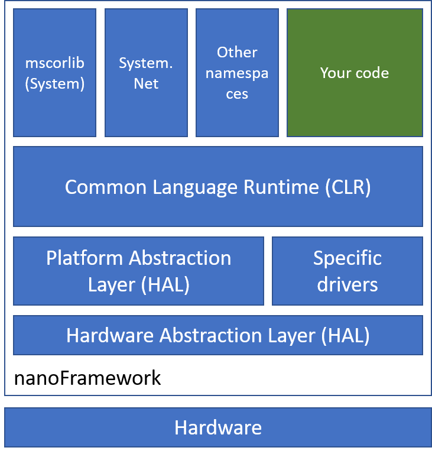

# .NET **nanoFramework** Architecture

- [Simplifications and trade-offs](simplifications-and-trade-offs.md)
- [Class Libraries](class-libraries.md)
- [Date and Time](date-and-time.md)
- [Floating point calculations](floating-point-calculations.md)
- [Application deployment](deployment.md)
- [Thread execution](thread-execution.md)
- [Native interrupt handlers](native-interrupt-handlers.md)
- [Wire Protocol](wire-protocol.md)
- [PE File format](pe-file/index.md)

As a summary, we can represent the nanoFramework architecture like this:

nanoFramework is build on an Hardware Abstraction Layer (HAL). The HAL allow to access the hardware in a consistant and standard way. This allow to have a set of functions that are exposed the same way to the Platform Abstraction Layer (PAL) and specific drivers.

The CLR is built on the PAL and offers multiple libraries. The one which is always used is mscorlib (System and few other namespaces). The modularity of nanoFramework allows to add as many namespaces, classes as you want. They'll all be linked to the CLR.
